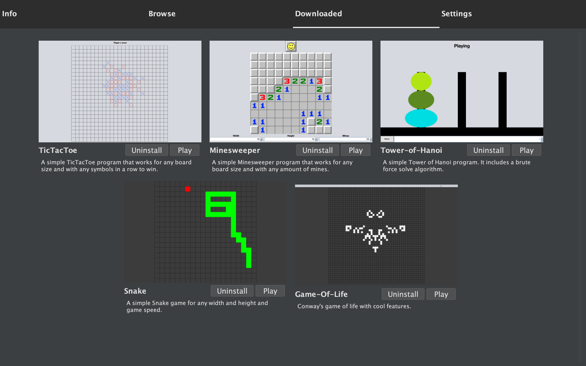

# GameLauncher
- A java swing program that downloads and allows you to play java games.
- **The program makes a games folder in the same directory the .jar file is in. (See Installation guide)**


## Features
- The program is divided into 4 tabs
- Info tab
  - Shows basic info about the project and how to use it
- Browse tab
  - Downloads a JSON file from this repository and shows all the games the JSON file points to
  - Games are displayed as cards
  - Each card has a screenshot of the game, a title and a description
  - Allows the user to download the games
- Downloaded tab
  - Shows the games that you have downloaded from the Browse tab
  - Uninstall button
  - Play button
- Settings tab
  - Allows the user to modify the UI of this program (Might require a restart)
  - Among the modifiable settings are navbar's color and background color, scroll speed, et cetera
 
## Installation guide
- Prerequisites:
  - JDK 21
- Download the latest release
- Navigate to the directory where your .jar is located and launch the .jar file with
```
  java -jar GameLauncher.jar
```
- The program makes a games folder in the same directory that the .jar file is in. So if you don't want to get suprised by a random games folder on your desktop, it is recommended that you put the .jar file into it's own folder

## Personal interest
- When I was learning Java in my programming seminar, I made a bunch of small games. So instead of letting them sit in my computer I made a game launcher to something cool with them. It was also an interesting way for me to look back at how much I have improved at coding.
